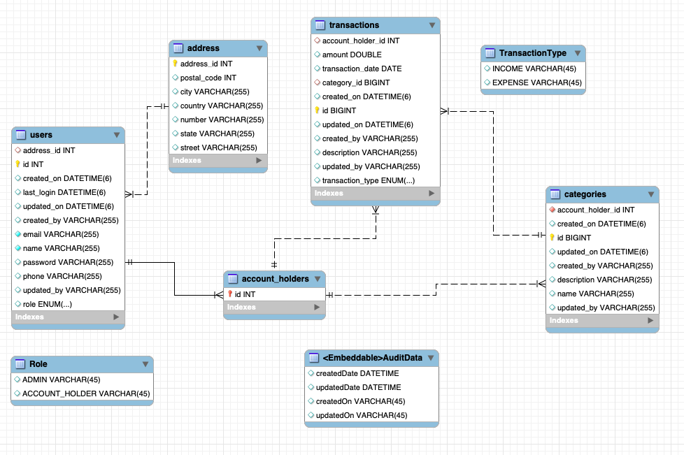

# PersonalBudgetTracker
 ## 1. Problem Statement
The Personal Budget Tracker aims to improve financial awareness and discipline by offering intuitive features, actionable insights, and a user-friendly platform. It is designed to help users effectively manage their finances by tracking income and expenses across various categories.

Initial Version
- Enables users to record financial transactions categorized as income or expenses, providing a clear overview of their financial activity.
- **The system supports two types of users:**:
  - Admin: Can manage Account Holders by reviewing user lists and removing inactive accounts. 
  - Account Holder: Can register, log in, reset passwords via email, and manage their financial data.

Future Features (Planned)...,
- Budget setup by category.
- Monthly savings goals with progress tracking.

 ---
 ## 2. Requirement Analysis: 
List all functional and non-functional requirements of the application.

### Functional Requirements:

- **User Authentication**:
  - Users can register, log in, and reset passwords via email.
  - APIs are role-based, providing specific functionality for Admins and Account Holders.
  
- **User Management**:
  - Account Holders can track and manage personal financial data securely.
  - Admins can view and delete inactive Account Holders.

- **Category Management**: 
  - Users can create and manage custom categories for transactions (e.g., Food, 1111Sale).
  
- **Transaction Management**:
  - Record income and expense transactions.
  - Transactions can be categorized using user-defined categories.

### Non-Functional Requirements:

- **Security**:
  - Passwords must be stored securely using encryption.
  - Robust authentication mechanisms to prevent unauthorized access.

- **Scalability and Maintainability**:
  - The application should support future features, such as notifying based on budget line and goal achievement.
  - Code should adhere to proper naming conventions, readability, and separation of concerns to facilitate easy maintenance and upgrades.

---

  ## 3. Software Modeling
### Use-case Diagram


### Class Diagram


---

  ## 4. Architecture


---

  ## 5. ER Diagram


---

  ## 6. Software Setup Instructions(Locally):
### Technologies Used
- **Backend**: Spring Boot(Java:23,Maven)
- **Frontend**: React.js (ver: 18.3.1)
- **Database**: MySQL
- **Authentication**: Spring Security
- **Version Control**: GitHub
- **Cloud**: Azure
### Prerequisites
- Java 23 installed
- Node.js and npm installed
- MySQL running locally or on a server

### Steps
1. Clone the repositories:
#### Backend
   ```bash
   git clone https://github.com/HsuMinHtet/PersonalBudgetTracker_Backend.git
   ```
#### Frontend
   ```bash
   git clone https://github.com/HsuMinHtet/PersonalBudgetTracker_Frontend.git
```
2. Navigate to the directories:
   ```bash
   cd PersonalBudgetTracker_Backend
    # or
    cd PersonalBudgetTracker_Frontend
   ```
3. Install dependencies: 
#### For Backend:
   ```bash
   mvn install
   ```
#### For Frontend:
   ```bash
   npm install
   ```
4. Run the application:
#### For Backend: 
###### 1. Configure your database connection in application.properties
###### 2. Configure your email address in application.properties for the forgot password function
###### 3. Admin User is initially registered at Application Class.(admin@budget.com,password@123) as default
   ```bash
   mvn spring-boot:run
   ```
#### For Frontend:
   ```bash
   npm run dev
   ```

---
## Video Record Link
   ```bash
   https://mum0-my.sharepoint.com/:v:/r/personal/hhtet_miu_edu/Documents/PersonalBudgetTracker/ProjectDemo.mov?csf=1&web=1&nav=eyJyZWZlcnJhbEluZm8iOnsicmVmZXJyYWxBcHAiOiJPbmVEcml2ZUZvckJ1c2luZXNzIiwicmVmZXJyYWxBcHBQbGF0Zm9ybSI6IldlYiIsInJlZmVycmFsTW9kZSI6InZpZXciLCJyZWZlcnJhbFZpZXciOiJNeUZpbGVzTGlua0NvcHkifX0&e=gRbIWS
```